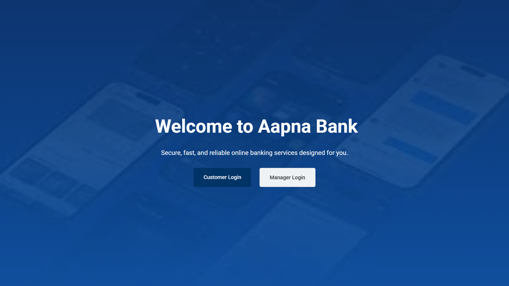
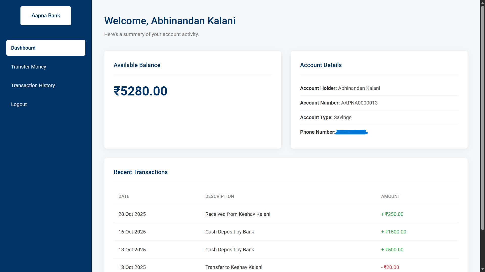
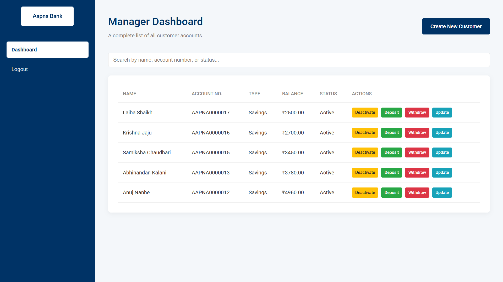
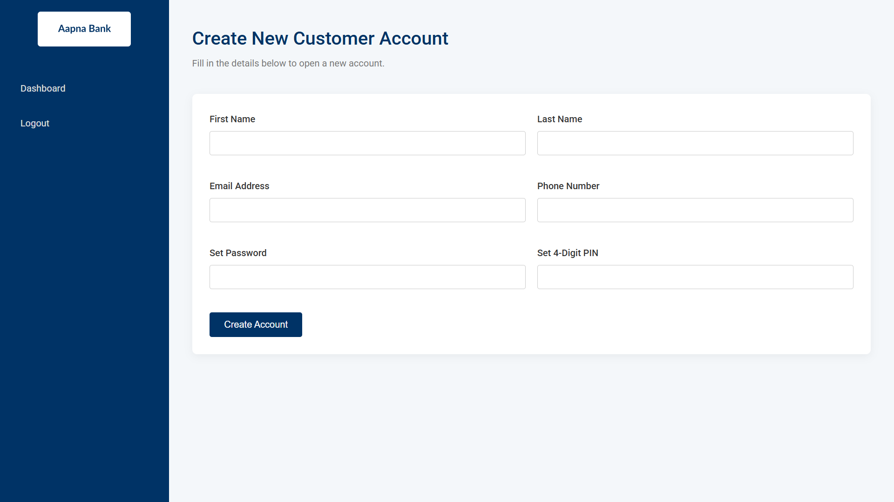

# 🏦 Aapna Bank - Core Banking Application

> A secure and robust core banking simulation built to perform essential financial operations online.

---

## 📖 Project Overview
**Aapna Bank** is a full-stack web application developed to simulate a real-world banking environment. It facilitates secure interactions for two distinct user roles: **Customers** and **Bank Managers**. The system is designed to handle core banking activities such as account creation, fund transfers, and administrative management, following the standard Software Development Life Cycle (SDLC).

---

## ✨ Key Features

### 👥 Role-Based Functionality
| **Customer Features** | **Manager (Admin) Features** |
| :--- | :--- |
| **🔐 Secure Registration:** Create accounts with unique email/phone validation. | **📋 Customer List:** View all account holders with search & filter options. |
| **💸 Fund Transfer:** Send money to other accounts (with balance validation). | **✅ Account Control:** Activate or deactivate customer accounts. |
| **📜 Passbook:** View complete transaction history (Credits/Debits). | **💰 Cash Ops:** Perform manual deposits and withdrawals for users. |
| **📊 Dashboard:** Real-time balance check and recent 5 transactions. | **✏️ User Management:** Update customer personal details. |

---

## 🛠️ Tech Stack

| Component | Technology Used |
| :--- | :--- |
| **Backend** | Python (Flask Framework) |
| **Database** | MySQL (Relational DB in 3NF) |
| **Frontend** | HTML5, CSS3, JavaScript |
| **Architecture** | MVC (Model-View-Controller) |

---

## 📸 Screenshots
| **Homepage** | **Customer Dashboard** |
| :---: | :---: |
|  |  |

| **Manager Dashboard** | **Registration Page** |
| :---: | :---: |
|  |  |

---

## 🗄️ Database Schema
The system uses a normalized Relational Database (3NF) with the following structure:

| Table Name | Description |
| :--- | :--- |
| **`USERS`** | Stores customer personal info, login credentials, and account status. |
| **`ACCOUNTS`** | Links to Users; stores account numbers and current balance. |
| **`TRANSACTIONS`** | Records all fund transfers, deposits, and withdrawals. |
| **`EMPLOYEES`** | Stores login credentials for Bank Managers. |

---

## 📂 Project Structure
The project is organized as follows:

```text
Aapna-Bank/
│
├── static/              # CSS and JavaScript files
├── templates/           # HTML templates for UI
├── app.py               # Main Flask application logic & routes
├── schema.sql           # SQL script for database creation
├── requirements.txt     # Python dependencies
└── README.md            # Project documentation
```

## ⚙️ Installation Guide

### 1. Clone the Project
```bash
git clone https://github.com/keshavkalani_15/Aapna-Bank.git
cd Aapna-Bank
```

### 2. Install Dependencies
```bash
pip install -r requirements.txt
```

### 3. Database Setup
> Open MySQL Workbench.
> Create a new schema named banking_db.
> Import the schema.sql file provided in this repo.

### 4. Run the Application
```bash
python app.py
```

> The application will start at http://127.0.0.1:5000/

## 📜 License
This project was developed for educational purposes as a Mini Project.
